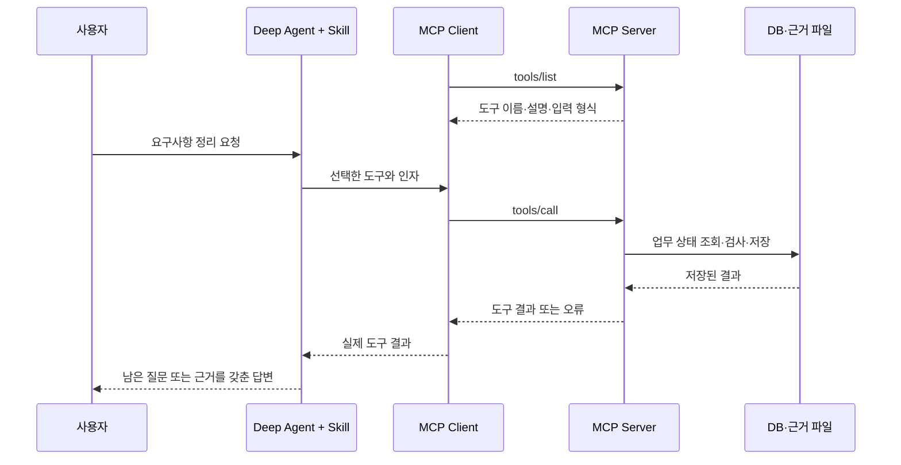

# MCP 서버, Stateless 요청, 저장된 업무 상태

이 문서는 MCP 서버 실습을 이해하기 위한 설명이다. 구현 순서는 [README의 1–6단계](README.md)를 따른다.
기준 환경은 `mcp==2.1.1`이며, 실제 stdio 연결에서 확인한 프로토콜은 **`2026-07-28`**이다.
프로토콜 설명은 해당 버전의 [공식 명세](https://modelcontextprotocol.io/specification/2026-07-28/basic/transports),
구현 방법은 [공식 서버 가이드](https://modelcontextprotocol.io/docs/develop/build-server)와
[Python SDK](https://github.com/modelcontextprotocol/python-sdk)를 참고한다.

## 1. 에이전트, MCP 클라이언트, 서버의 역할

사용자에게 질문하고 답변하는 주체는 [agent.py](agent.py)의 Deep Agent다.
MCP 클라이언트는 서버의 도구 목록과 입력 형식을 읽고, 에이전트가 선택한 도구를 호출한다.
서버는 요청을 검증하고 업무 함수를 실행한 뒤 실제 결과를 반환한다.



이 그림은 업무 도구의 흐름이다. 버전·기능 확인과 메시지의 프로토콜 메타데이터는 SDK가 처리한다.
Skill은 질문·파일 읽기·보고의 순서를 안내하고, MCP는 클라이언트와 서버의 메시지 계약을 제공한다.
질문 생성이나 명세 품질 판단 자체가 MCP의 내장 기능인 것은 아니다.
[공식 아키텍처](https://modelcontextprotocol.io/docs/learn/architecture)

## 2. 공식 Python SDK 방식으로 도구를 공개한다

서버는 `MCPServer`를 만들고, 타입 힌트와 docstring이 있는 함수를 `@mcp.tool()`로 등록한다.
SDK가 도구 정의·입력 스키마·호출 처리를 담당하므로 JSON-RPC 파서를 직접 만들 필요가 없다.
다음은 공식 방식의 최소 예다. 수업의 업무 구현은 [reference/server.py](reference/server.py)에 있다.

```python
from mcp.server import MCPServer

mcp = MCPServer("example")

@mcp.tool()
def add(a: int, b: int) -> int:
    """두 정수의 합을 반환한다."""
    return a + b

if __name__ == "__main__":
    mcp.run(transport="stdio")
```

수업 서버에서는 `start_interview`, `record_answer`, `get_session`, `freeze_seed`와
근거 저장·목록·본문 조회의 세 도구를 등록한다. 업무 처리는 `Workflow`, 파일 처리는 `EvidenceStore`에 맡긴다.
서버 도구 함수는 입력을 전달하고 업무 오류를 결과로 바꾸는 얇은 연결부다.
[공식 Python SDK의 서버 예제](https://github.com/modelcontextprotocol/python-sdk#a-server-in-15-lines)

클라이언트는 다음 공개 API를 사용한다.

```python
from mcp import Client
from mcp.client.stdio import StdioServerParameters
```

[client.py](client.py)의 `async with Client(server_parameters(...))` 안에서
`list_tools()`와 `call_tool()`을 호출한다. 응답의 `structured_content`를 읽어 업무 결과를 확인한다.
[mcp_langchain.py](mcp_langchain.py)는 이를 에이전트가 사용할 LangChain 도구로 연결한다.
현재 변환기는 문자열·정수·실수·불리언·문자열 enum을 다룬다. 중첩 객체·배열 스키마를 추가한다면 변환기와 검사도 함께 확장해야 한다.

## 3. stdio에서 실제로 일어나는 일

현재 실습은 **stdio**를 사용한다. 클라이언트가 서버를 자식 프로세스로 실행하고,
서버의 `stdin`·`stdout`으로 JSON-RPC 메시지를 주고받는다. 서버를 별도 터미널에서 계속 켜둘 필요는 없다.
연결을 닫으면 클라이언트가 서버 프로세스의 종료를 관리한다.

`stdout`에는 MCP 메시지만 써야 한다. 도구 실행 중 `print()`로 진단 로그를 출력하면 통신에 섞일 수 있다.
진단은 `stderr`나 파일에 쓴다. `stderr` 메시지가 있다는 사실만으로 요청 실패라고 판정하지 않고,
실제 응답과 종료 결과를 확인한다.
[공식 stdio 명세](https://modelcontextprotocol.io/specification/2026-07-28/basic/transports/stdio)

| 전송 방식 | 실행 형태 | 메시지를 전달하는 곳 |
|---|---|---|
| stdio | 클라이언트가 실행한 로컬 자식 프로세스 | 표준 입력·출력 |
| Streamable HTTP | 독립적으로 실행하는 서버에 접속 | MCP endpoint의 HTTP POST, JSON 또는 요청별 SSE 응답 |

프로토콜의 도구 계약과 업무 코드는 전송 방식과 분리해서 읽는다.
HTTP로 바꾼다고 질문·명세의 저장 정책이 자동으로 바뀌지는 않는다.
[공식 전송 방식](https://modelcontextprotocol.io/specification/2026-07-28/basic/transports),
[Streamable HTTP](https://modelcontextprotocol.io/specification/2026-07-28/basic/transports/streamable-http)

## 4. Stateless는 무엇을 뜻하는가?

**현재 명세는 요청마다 필요한 프로토콜 정보를 전달한다.** `2026-07-28`에서는 요청의 `_meta`에
프로토콜 버전·클라이언트 기능 등의 정보를 담고, 서버가 각 요청을 받아들일 수 있는지 판단한다.
이 정보를 정하기 위해 반드시 먼저 `initialize`를 호출하는 방식이 아니다.
클라이언트는 `server/discover`로 서버가 지원하는 정보를 확인할 수 있고, SDK가 버전 호환 처리를 담당한다.
[공식 버전과 호환성](https://modelcontextprotocol.io/specification/2026-07-28/basic/versioning)

이 특성은 **연결이 없어져도 모든 업무 데이터가 사라져야 한다는 뜻이 아니다.**
우리 서버는 요청의 업무 인자로 받은 `session_id`를 사용해 DB와 파일에서 상태를 읽는다.
프로세스가 새로 시작되어도 같은 저장소를 전달하면 업무를 이어갈 수 있다.

| 구분 | 이 실습의 예 | 어디에 있는가? |
|---|---|---|
| 프로토콜 정보 | 버전·기능 등 요청별 메타데이터 | SDK가 메시지에 담아 전달 |
| 업무 식별자 | 도구 인자의 `session_id` | 클라이언트가 도구 호출에 전달 |
| 업무 상태 | 목표·답변·명세·변경 기록 | SQLite와 `evidence/` 파일 |
| 에이전트 대화 | 이번 실행에서 주고받은 메시지 | 이번 에이전트 실행. 다음 CLI 실행에 자동 주입하지 않음 |

따라서 **Stateless 프로토콜 위에 상태가 있는 업무를 구현할 수 있다.**
`session_id`라는 이름만 보고 MCP가 유지하는 연결 세션이라고 설명하면 두 층을 혼동하게 된다.
이 값은 이 수업에서 만든 업무 ID이며, JSON-RPC의 요청·응답 연결용 `id`와도 다르다.

### 이전 명세와 혼동하지 않기

`2025-11-25`와 그 이전 명세는 `initialize`로 연결 범위의 버전·기능을 정하는 방식을 사용했다.
이전 Streamable HTTP 문서에는 `MCP-Session-Id`를 사용하는 세션 관리도 나온다.
현재 SDK는 이전 버전과의 호환 처리를 지원하므로 오래된 예제에서 이 이름을 볼 수 있다.
문서의 버전을 확인하고, 현재 실습의 업무 `session_id`와 구분한다.
[현재 명세의 이전 버전 호환 설명](https://modelcontextprotocol.io/specification/2026-07-28/basic/versioning#backward-compatibility-with-initialization-based-versions)

이 실습에서는 프로토콜 메타데이터를 수동으로 조립하거나 stdio에 HTTP 전용 설정을 붙이지 않는다.
연결에 실제 사용한 버전은 `Client.protocol_version`으로 확인하며, 에이전트의 `connected` 실행 기록에도 남긴다.

## 5. 업무 상태는 요청 인자와 저장소로 이어간다

피해야 할 설계는 “방금 대화한 사용자의 현재 세션”을 서버의 전역 변수 하나에 넣어 두는 것이다.
다른 요청과 섞이거나 서버 재시작으로 잃어버릴 수 있다.
이 수업에서는 새 업무를 시작하면 ID를 반환하고, 이후 도구가 그 ID를 명시적으로 받는다.

```text
start_interview(goal)
  → session_id 반환, 시작 기록 저장
record_answer(session_id, field, answer)
  → 해당 업무의 상태를 읽고 답변 기록 추가
get_session(session_id)
  → 저장된 기록으로 현재 상태와 남은 질문 복원
freeze_seed(session_id)
  → 조건 검사 후 확정 명세 저장
```

업무 상태를 만드는 과정은 [workflow.py](reference/workflow.py)의 `replay`와 `_load`에서 읽는다.
`Workflow` 객체에는 저장 위치를 두고, 각 업무의 목표·답변은 요청마다 저장소에서 불러온다.
`draft`는 답변이 부족한 상태, `ready`는 필수 답변이 모인 상태, `frozen`은 명세가 확정된 상태다.
`ready`만으로 답변의 의미가 충분하거나 목표가 달성됐다고 판단하지 않는다.

## 6. 변경 기록, 확정 명세, 재시도를 함께 설계한다

현재 상태만 덮어쓰면 어떤 질문과 답변으로 그 상태가 만들어졌는지 알기 어렵다.
이 구현은 시작·답변·확정을 변경 기록으로 추가하고, 저장 순서대로 읽어 현재 상태를 복원한다.
확정 명세는 별도 파일로 내보내 후속 작업이 원문을 읽을 수 있게 한다.

| 설계 | 구현에서 확인할 곳 | 필요한 이유 |
|---|---|---|
| 도구와 업무 코드 분리 | `server.py` → `workflow.py` | 통신·입력 형식과 업무 조건을 따로 검사 |
| 변경 기록 추가 | `Workflow._append`, `replay` | 답변 수정 이력과 현재 상태를 함께 설명 |
| 확정 조건 검사 | `Workflow.freeze_seed` | 필수 답변 없는 확정과 확정 후 수정을 서버에서 거절 |
| 원문과 산출물 분리 | `EvidenceStore.publish_events`, `save` | 명세를 보존하고 계획·보고서를 별도 파일로 저장 |
| 원본 근거 연결 | `source_evidence_id` | 어떤 명세를 읽고 후속 산출물을 만들었는지 추적 |

재시도도 도구마다 다르다. Stateless라는 이유만으로 모든 호출을 무조건 반복해도 되는 것은 아니다.

| 호출 | 현재 구현의 재호출 결과 |
|---|---|
| `start_interview` | 새 업무와 새 ID를 만든다. 응답을 놓쳤다고 무조건 반복하면 업무가 중복될 수 있다. |
| 같은 `record_answer` | 답변 내용이 같으면 업무 변경 기록을 추가하지 않는다. |
| 이미 확정한 `freeze_seed` | 같은 명세를 반환한다. |
| 같은 제목·본문·원본 ID의 `save_evidence` | 같은 산출물 ID를 사용한다. 내용이 바뀌면 별도 파일이다. |
| `get_session` | 상태를 조회하고 필요한 DB 복원·근거 파일 내보내기도 수행한다. |

위의 같은 결과는 **업무 상태 기준**이다. 도구 호출 자체의 근거 기록은 호출할 때마다 별도로 남는다.
코드는 [Workflow](reference/workflow.py)와 [EvidenceStore](reference/evidence.py)를 대조한다.

## 7. 오류를 어느 층에서 다루는가?

| 상황 | 처리 위치 | 관찰할 결과 |
|---|---|---|
| 필수 인자 누락·enum 위반 | SDK 입력 검증 | 도구 실행 오류의 `isError` / SDK의 `is_error` |
| 답변 부족·확정 후 수정 | 업무 코드 | 구조화된 결과의 `success=false`, 업무 오류 코드 |
| 정상 조회 0건 | 업무 코드 | 성공한 조회 결과와 빈 목록 |
| 예상하지 못한 실행 실패 | SDK 오류 처리 | 실행 실패를 성공 응답으로 바꾸지 않음 |
| DB 저장 후 근거 내보내기 실패 | 업무 코드 | `evidence_publish_failed`, `state_saved=true` |

SDK가 인자 형식을 검사하더라도 “명세가 이미 확정됐는가?” 같은 업무 조건은 우리가 검사해야 한다.
이 구현의 `success`와 `error`는 수업용 업무 응답 형식이며 MCP가 모든 도구에 강제하는 필드가 아니다.
[서버 코드](reference/server.py), [공식 도구 명세](https://modelcontextprotocol.io/specification/2026-07-28/server/tools)

SQLite 저장과 파일 저장은 하나의 원자적 작업이 아니다. DB는 저장됐지만 파일 내보내기가 실패할 수 있다.
그 경우 DB가 롤백됐다고 말하지 않고, 위치를 복구한 뒤 `get_session`으로 다시 내보낸다.
파일과 DB의 공통 기록이 서로 다르면 임의로 덮어쓰지 않고 충돌을 알린다.

## 8. 파일만 전달하는 재개 검사

아래 순서가 실제로 되는지를 확인한다.

1. 첫 에이전트와 MCP 서버로 질문·답변·명세·요약을 저장한다.
2. 실행이 끝나면 근거 폴더 전체를 별도 위치로 복사한다.
3. 이전 대화와 DB를 주지 않은 새 에이전트·새 서버를 실행한다.
4. `list_evidence`와 `read_evidence`로 명세 원문을 읽는다.
5. 필요하면 `get_session`이 이벤트 파일을 새 DB에 복원한다.
6. 후속 계획을 `save_evidence`로 저장하고 원본 ID를 연결한다.

`read_evidence`와 `list_evidence`는 파일을 직접 읽는다. DB 복원이 필요한 업무 재개는 `get_session`이 담당한다.
단순 호출 기록만 남겨서는 보고서 본문을 재사용할 수 없으므로 에이전트가 작성한 본문도 저장 도구에 보내야 한다.

```bash
# 모델 없이 실제 서버 프로세스·재시작·근거 파일 검사
.venv/bin/python build_mcp/verify.py
# 실제 모델과 별도 에이전트·서버 프로세스로 네 사례 검사 (유료)
.venv/bin/python build_mcp/verify_agent.py
```

첫 검사는 서버 계약, 둘째는 Skill 읽기와 실제 에이전트의 도구 사용·파일 재개를 확인한다.
문서의 설명과 출력이 다르면 [실제 구현](reference/workflow.py)과 근거 파일에서 차이가 발생한 위치를 찾는다.

## 마무리 질문

- Stateless 요청인데도 `session_id`와 DB가 필요한 이유는 무엇인가?
- 서버를 재시작했을 때 프로토콜 정보, 업무 상태, 에이전트 대화는 각각 어떻게 되는가?
- 같은 도구를 다시 호출해도 되는지 어떤 코드와 결과로 판단하는가?
- Skill이 조건을 지키라고 말하는 것과 서버가 조건을 검사하는 것은 어떻게 다른가?
- 파일 저장에 실패했는데 DB는 저장됐다면, 무엇을 보고하고 어떻게 복구해야 하는가?
