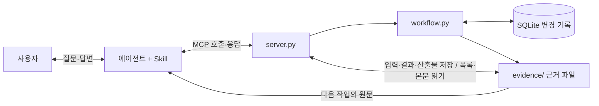

# 질문 강화형 Deep Agent와 MCP 서버 만들기

**완성 목표:** 사용자의 요청을 질문으로 구체화하는 Deep Agent에 MCP 서버와 Skill을 연결한다.
직접 만든 서버로 목표·제약·완료 기준을 기록하고 명세를 확정하며, 작업 내용을 `evidence/`에 모은다.
다음 작업에서는 저장한 명세·계획을 파일에서 읽는다. 대화 기록과 DB 없이 근거 폴더만 전달받아도 이어갈 수 있게 한다.

먼저 [코딩 Skill 실습](../coding_skills/README.md)에서 Skill 선택과 실제 도구 실행을 살펴본다.
이번에는 [requirements-interview Skill](skills/requirements-interview/SKILL.md)이 부족한 답변을 확인하고,
[Deep Agent](agent.py)가 별도 MCP 서버의 도구를 호출한다. 아래 1–6단계에서 서버와 Skill을 차례로 만든다.

**질문 강화**는 빠진 제약·완료 기준이나 모호한 답변을 사용자에게 확인해 요구사항을 구체화하는 것이다.
필수 질문 항목과 명세 확정 조건은 서버가 관리하고, 추가 확인이 필요한지는 Skill을 읽은 에이전트가 판단한다.

## 공식 MCP 방식과 이번 구현의 설계

[공식 서버 가이드](https://modelcontextprotocol.io/docs/develop/build-server)의
`MCPServer`·`@mcp.tool()`·타입 힌트·docstring을 사용한다. 직접 JSON-RPC를 구현하는 대신
SDK가 도구 공개·입력 검증·전송을 맡고, 우리가 작성한 업무 코드가 질문·확정·저장을 담당한다.

구현에 앞서 [MCP와 Stateless 요청 설명](MCP_GUIDE.md)을 읽는다.
현재 실습에서 확인한 프로토콜은 `2026-07-28`이다. 요청마다 프로토콜 정보를 전달하는 Stateless 특성과,
업무 `session_id`로 DB·근거 파일에서 상태를 복원하는 설계를 구분한다.

| 핵심 설계 | 이 실습에서 확인할 곳 |
|---|---|
| 도구 공개와 업무 처리 분리 | `server.py`의 도구 함수 → `Workflow` |
| 명시적인 업무 ID로 재개 | `get_session(session_id)` |
| 필수 답변 검사와 명세 확정 | `freeze_seed`, 확정 후 수정 거절 |
| 변경 기록의 저장과 재구성 | `Workflow._append`, `replay` |
| 원문 보존과 후속 산출물 연결 | `EvidenceStore`, `source_evidence_id` |
| 실패와 재시도 처리 | 업무 오류, 중복 답변·중복 확정, 저장 실패 복구 |

명세를 확정했다는 것은 목표·제약·완료 기준을 저장했다는 뜻이다.
요구사항의 의미적 충분성이나 프로그램 구현 완료는 별도로 확인한다.

**MCP는 도구 호출과 응답을 전달한다. 질문 순서, 확정 조건, 근거 저장은 우리가 작성하는 업무 코드다.**



## 준비와 기준 구현

명령은 모두 **Day04 폴더에서** 실행한다. [기존 준비 과정](../README.md#준비)의 `.venv`를 사용한다.
고정한 Python SDK를 사용한다. 직접 호출과 자동 검사에는 모델/API 키가 필요 없다.

```bash
.venv/bin/python build_mcp/client.py list
.venv/bin/python build_mcp/verify.py
```

첫 명령은 일곱 도구의 이름·설명·입력 형식을 출력한다. 두 번째는 실제 stdio 연결로 1–5단계를 검사한다.
`rejected arguments`는 일부러 보낸 잘못된 입력이 거절된 기록이다. 마지막에 `5단계 통과`까지 확인한다.

| 파일 | 읽을 내용 |
|---|---|
| [reference/server.py](reference/server.py) | 도구 등록, 입력·반환 형식, 호출 기록을 남기는 middleware |
| [reference/workflow.py](reference/workflow.py) | 시작·답변·확정 조건, 변경 기록에서 상태 복원 |
| [reference/evidence.py](reference/evidence.py) | 근거 파일 저장·조회, 산출물과 원본 근거 연결 |
| [client.py](client.py) | 모델 없이 도구 목록 조회와 한 번의 호출 |
| [verify.py](verify.py) | 작성 중인 서버의 단계별 계약 검사 |
| [agent.py](agent.py) | 실제 Deep Agents 생성, stdio 서버 연결, Skill 읽기와 대화 기록 |
| [llm.py](llm.py) | 공통 `Day04/.env`를 읽고 이 실습의 모델 연결 |
| [mcp_langchain.py](mcp_langchain.py) | MCP 입력 형식·응답을 LangChain 도구로 변환 |
| [verify_agent.py](verify_agent.py) | 실제 모델을 사용하는 네 사례. 에이전트·서버 재시작과 근거 파일 대조 |
| [Skill 예제](skills/requirements-interview/SKILL.md) | 질문 진행 → 파일 읽기 → 후속 산출물 저장 |

강사는 `start_interview` 하나를 작성하고 실행하는 과정을 먼저 보여준다. 수강생은 아래 폴더에 자기 코드를 작성한다.

```bash
mkdir -p work/my-mcp/skills/requirements-interview
```

작성할 파일은 `server.py`, `workflow.py`, `evidence.py`, `skills/requirements-interview/SKILL.md`다.
서버는 `--db`와 `--evidence-dir`를 받고 `stdio`로 실행하게 한다. 1–3단계에서는 두 옵션을 받기만 하고 메모리로 상태를 관리해도 된다.
4단계에서 DB 저장, 5단계에서 근거 파일을 붙인다. 검사기는 임시 DB·근거 폴더를 사용하므로 기존 작업을 건드리지 않는다.

## 1. 함수를 MCP 도구로 공개하기

**만들 것:** `start_interview(goal: str)`와 `get_session(session_id: str)`.

시작 도구는 새 세션 ID·목표·첫 질문을 반환한다. 조회 도구는 해당 세션의 현재 상태를 반환한다.
공백 목표는 `success=false, error=empty_goal`, 없는 세션은 `success=false, error=session_not_found`로 거절한다.

응답 항목은 `success`, `session_id`, `status`, `goal`, `answers`, `missing_fields`, `next_question`, `seed`, `event_count`다.
처음에는 `status=draft`, 답변은 빈 객체, `seed=null`이다. 필수 질문은 제약(`constraints`)과 완료 기준(`acceptance_criteria`)이다.
`next_question`은 질문할 `field`와 질문 문장 `text`를 함께 반환한다.

`@mcp.tool()`, 타입 표기, 설명 문자열이 `client.py list`에 어떻게 나타나는지 대조한다.
이 환경에서는 반환 타입을 `dict[str, Any]`로 적어 구조화된 객체 응답을 제공한다.

```bash
.venv/bin/python build_mcp/verify.py --server work/my-mcp/server.py --stage 1
```

**정리:** 함수가 업무를 처리하고 MCP가 외부 호출을 연결했다. 모델 없이도 검사할 수 있다.
**설명해 보기:** 도구의 설명 문자열과 실제 동작이 다르면 무엇을 확인해야 하는가?

## 2. 답변을 기록하고 다음 질문 반환하기

**만들 것:** `record_answer(session_id, field, answer)`.

`field`는 제약과 완료 기준만 받도록 입력 형식을 제한한다. 공백 답변은 `error=empty_answer`로 거절한다.
확정 전 답변은 수정할 수 있고, 아직 답하지 않은 첫 항목을 다음 질문으로 반환한다. 제약이 없다면 사용자가 `없음`이라고 답한다.
두 항목에 답하면 `status=ready`, `missing_fields=[]`, `next_question=null`이 된다.

```bash
.venv/bin/python build_mcp/verify.py --server work/my-mcp/server.py --stage 2
```

**정리:** 세션 ID가 여러 호출을 같은 작업으로 묶는다.
**설명해 보기:** 답변을 고쳤을 때 현재 답변과 수정 전 답변을 각각 어디에 남길 것인가?

## 3. 명세 확정 조건을 서버에서 검사하기

**만들 것:** `freeze_seed(session_id)`.

필수 답변이 남았으면 `error=seed_incomplete`와 `missing_fields`를 반환한다.
모두 답했으면 목표·제약·완료 기준·새 `seed_id`를 명세에 넣고 `status=frozen`으로 바꾼다.
재확정은 같은 명세를 반환하고, 확정 후 답변 변경은 `error=seed_frozen`으로 거절한다.

```text
draft ── 필수 답변이 모임 ──> ready ── 확정 호출 ──> frozen
```

`ready`는 항목이 채워졌다는 뜻이다. “잘 되면 완료”처럼 모호한 답변의 품질을 보장하지 않는다.

```bash
.venv/bin/python build_mcp/verify.py --server work/my-mcp/server.py --stage 3
```

**정리:** Skill 지침과 별개로 서버가 확정 조건을 검사한다.
**설명해 보기:** Skill을 읽지 않고 바로 확정 도구를 호출해도 조건이 지켜지는가?

## 4. 서버를 다시 켜도 이어가기

**만들 것:** 시작·답변·확정 변경 기록의 저장과 복원.

기준 구현은 SQLite에 `interview_started`, `answer_recorded`, `seed_frozen`을 추가한다.
`replay`는 이 기록을 순서대로 읽어 상태를 다시 만든다. `event_count`는 상태 변경 기록 수다.
조회·실패·중복 답변·재확정은 이 수를 늘리지 않는다. 다음 단계의 호출 기록 파일 수와는 다르다.

```bash
.venv/bin/python build_mcp/verify.py --server work/my-mcp/server.py --stage 4
```

검사기는 실제 서버 프로세스를 종료하고 같은 DB로 다시 시작한다. 확정 명세와 미완료 세션을 모두 조회한다.

**정리:** MCP 연결이 끝나도 업무 상태는 남는다.
**설명해 보기:** 전역 딕셔너리만 쓰면 재시작 후 무엇이 사라지는가?

## 5. 모든 작업 내용을 근거 파일로 모으고 다시 사용하기

**만들 것:** 별도 `evidence/` 저장과 `list_evidence`, `read_evidence`, `save_evidence` 도구.

기본 위치는 Day04에서 실행했을 때 `Day04/evidence/`다. DB의 위치와 분리되며 `--evidence-dir`로 바꿀 수 있다.

```text
evidence/
  <session_id>/
    event-00000001.json    # 목표와 질문
    event-00000002.json    # 답변 (수정본도 새 번호로 추가)
    seed-<seed_id>.json    # 확정 명세
    call-<call_id>.json    # 각 도구 호출의 입력·결과, 실패 포함
    artifact-<id>.json     # 작업 중 작성한 계획·분석·보고서·요약
  _unassigned/
    call-<call_id>.json    # 세션이 없는 호출·세션 생성 전 실패
```

각 UTF-8 JSON 파일에는 `evidence_id`, `session_id`, `kind`, `title`, `exported_at`, `source_evidence_id`, `content`를 담는다.
`content`가 실제 원문이다. 이벤트·명세·호출 결과는 객체, 후속 산출물은 전체 텍스트다.
`exported_at`은 파일로 내보낸 시간이며 과거 이벤트의 발생 시간으로 해석하지 않는다.

| 도구 | 입력 | 결과 |
|---|---|---|
| `list_evidence` | `session_id` (생략 가능) | 세션별 파일 ID·제목·경로. 생략하면 보관된 세션의 `session_id`와 `goal` 목록 |
| `read_evidence` | `session_id`, `evidence_id` | 파일 본문과 현재 경로 |
| `save_evidence` | `session_id`, `title`, `content`, 선택 `source_evidence_id` | 저장된 산출물의 ID·본문·경로 |

세션 ID를 생략한 `list_evidence`는 세션마다 `{"session_id": ..., "goal": ...}`을 반환한다. 세션 ID는 32자리 16진수라
목록만 보고는 어느 작업인지 구분할 수 없다. 목표는 `event-00000001.json`의 `content.payload.goal`에서 읽으며 DB는 읽지 않는다.
시작 기록이 없거나 손상된 세션은 `goal`을 `null`로 두고 목록에는 남긴다. 한 세션이 깨져도 나머지를 못 찾으면 안 된다.

네 업무 도구는 상태를 저장한 뒤 목표·질문·답변·명세를 파일로 내보낸다. 응답에 `evidence_dir`, 확정 후 `seed_evidence_id`도 넣는다.
middleware는 일곱 도구의 입력과 결과를 응답 전에 기록한다. SDK의 입력 형식 오류와 `success=false`도 보관한다.
목록 조회 결과는 그 호출 자체의 기록이 추가되기 전 시점이다. 실패나 중복 호출도 `call-*.json`에는 남는다.

**에이전트가 작성한 본문은 반드시 `save_evidence`로 보낸다.** 서버가 볼 수 있는 범위는 도구로 받은 입력과 결과다.
문서·코드·메모는 전체 텍스트를 산출물로 등록한다. 전용 `agent.py`는 사용자 요청과 공개된 대화·도구 결과도
`evidence/_runs/`의 JSONL에 기록한다. 다음 작업에서 재사용할 문서는 `save_evidence`로 세션에 연결한다.
키와 `.env` 내용은 보내지 않는다. 수집한 근거 폴더는 Git에서 제외한다.

같은 내용·제목·원본 ID를 재전송하면 같은 산출물 파일을 반환한다. 내용이 달라지면 새 파일을 만든다.
명세와 과거 답변을 덮어쓰지 않는다. `source_evidence_id`는 같은 세션에 실제 존재하는 파일만 연결한다.
후속 작업에서는 원본의 본문을 먼저 읽고, 이를 바탕으로 만든 산출물에 원본 ID를 넣는다.

```bash
.venv/bin/python build_mcp/verify.py --server work/my-mcp/server.py --stage 5
```

이 단계는 질문·답변 수정 이력·명세·실패 기록을 실제 파일에서 확인한다. 이어서 **근거 폴더만 복사하고 새 DB**로 실행해
명세와 산출물을 읽고 미완료 세션을 이어간다. 손상된 파일의 거절과 저장 실패 복구도 검사한다.

기준 구현의 `get_session`은 DB가 없으면 이벤트 파일에서 상태를 복원한다. DB와 파일의 공통 기록이 다르면 충돌을 알린다.
DB 커밋과 파일 저장은 하나의 트랜잭션이 아니다. 파일 내보내기가 실패하면 `evidence_publish_failed`, `state_saved=true`로 알린다.
저장 위치를 복구한 뒤 같은 세션의 `get_session`으로 다시 내보낸다. 호출 기록 자체를 쓸 수 없으면 MCP 오류가 반환될 수 있다.
서버가 작업 중일 때 폴더 일부를 복사하면 마지막 기록이 빠질 수 있으므로, 전달은 진행 중인 호출이 끝난 뒤 폴더 전체로 한다.

**정리:** DB는 실행 상태를 관리하고 근거 파일은 다음 작업에 전달할 원문을 보관한다.
**설명해 보기:** 호출 로그만 있고 보고서 본문이 없으면 다음 작업자는 무엇을 재사용할 수 없는가?

## 6. 파일을 읽고 산출물을 남기는 Skill 작성하기

자기 `SKILL.md`에 적용할 요청, 질문 진행 순서, 파일 기반 재개, 산출물 저장과 완료 보고를 적는다.
새 요청은 시작 도구로 연결하고 이미 받은 제약·완료 기준은 다시 묻지 않는다. 부족한 답변은 사용자에게 확인한다.
기존 작업은 목록 → 필요한 파일 본문 읽기 → 후속 작업 → 산출물 저장 순서로 진행한다.
최종 답변에는 실제 세션 ID·원본 근거 ID·새 산출물 ID·저장 경로를 남긴다.

[Skill 구조와 작성 기준](../SKILLS_GUIDE.md)을 읽고, frontmatter·내부 파일의 상대 경로·단계적 읽기 구조를 유지한다.
이름·설명과 업무 절차는 [기준 Skill](skills/requirements-interview/SKILL.md)과 대조한다.

이제 [agent.py](agent.py)의 `run`을 읽는다. 실제 Deep Agents 객체와 MCP 서버 프로세스를 다음 순서로 연결한다.

1. `StdioServerParameters`에 파이썬·서버 경로·DB·근거 폴더를 지정한다.
2. `async with Client(...)`로 자식 MCP 서버 프로세스를 시작하고 도구 목록을 가져온다.
3. `wrap_tools`로 MCP 도구를 LangChain 도구로 변환한다. 변환 코드는 같은 폴더의 [mcp_langchain.py](mcp_langchain.py)에 있다.
4. `create_deep_agent`에 모델·도구·Skill용 `FilesystemBackend`를 전달한다.
5. `agent.astream`으로 실행하며 실제 Skill 본문 읽기, 도구 호출·결과, 최종 답변을 기록한다.

Skill은 [공식 Skills 방식](https://docs.langchain.com/oss/python/deepagents/skills)에 따라 이름·설명을 먼저 발견하고 본문은 필요할 때 읽는다.
Skill 폴더에는 읽기 도구를 제공하고, 업무 산출물은 MCP의 `save_evidence`를 통해 저장하게 한다.
이 실습은 [HarnessProfile](https://docs.langchain.com/oss/python/deepagents/profiles)로 기본 하위 에이전트를 끄고 한 에이전트의 MCP 사용을 관찰한다.

아래 실행은 모델을 여러 번 호출하며 계정 사용량이 발생한다. 기존 Day04의 `.env`와 고정 패키지를 그대로 사용한다.

```bash
.venv/bin/python build_mcp/agent.py --server work/my-mcp/server.py --skills-dir work/my-mcp/skills --prompt '주간 CSV 매출 요약 도구의 명세를 만들어 줘. 제약은 외부 전송 금지이고, 완료 기준은 CSV 합계와 보고서 합계가 일치하는 것이야. 최종 요약도 근거 파일로 저장해 줘.'
```

기준 서버와 Skill을 실행하려면 `--server`와 `--skills-dir`를 생략한다.
새 대화에서 실제 응답의 세션 ID를 넣어 다음 요청을 한다.

> 세션 SESSION_ID의 명세 파일을 읽고 구현 계획을 만들어 줘. 계획 전체를 저장하고 원본 근거 ID를 연결해 줘.

호출 기록에서 `read_evidence` → `save_evidence`를 확인하고 파일 본문을 직접 연다.
명세가 만들어졌다는 사실을 프로그램 구현 완료로 설명하면 안 된다. 모델이 목표를 “명세 만들기”로 바꾸어 기록하는 경우도 있으므로
입력 목표와 저장된 목표를 대조한다. `verify.py`는 서버 계약, 다음 `verify_agent.py`는 실제 에이전트 실행을 확인한다.
생성된 계획의 의미적 품질과 충분성은 파일 본문을 읽고 별도로 평가한다.

**정리:** Skill이 절차를 안내하고 서버가 실제 근거 파일을 저장했다.
**설명해 보기:** 최종 답변에 경로만 적고 저장 도구를 호출하지 않으면 어떤 검사를 통과하지 못하는가?

## 실제 Deep Agents 프로세스로 통합 검증하기

**모델 호출 약 20~35회, 2~5분 예상이다.** 검사 중인 사례와 결과가 터미널에 표시된다.

```bash
.venv/bin/python build_mcp/verify_agent.py
# 내가 작성한 서버와 Skill 검사
.venv/bin/python build_mcp/verify_agent.py --server work/my-mcp/server.py --skills-dir work/my-mcp/skills
```

| 사례 | 에이전트에 주는 요청 | 실제로 대조할 것 |
|---|---|---|
| 01 불완전한 명세 | 목표만 기록하고 확정 거절을 점검 | `seed_incomplete`, 임의 답변·명세 없음 |
| 02 새 대화에서 재개 | 세션 ID와 제약·완료 기준 제공 | `get_session`, 명세 원문, 연결된 요약 파일 |
| 03 확정 후 수정 | 기존 명세의 제약 변경을 한 번 시도 | `seed_frozen`, 명세와 변경 기록 수 유지 |
| 04 파일만 전달 | 근거 폴더를 읽고 상태 복원·계획 작성 | 새 DB 복원, 명세 본문 읽기 → 원본 ID를 연결한 계획 저장 |

검사기는 사례마다 `agent.py`를 새 프로세스로 실행한다. 그 안에서 새 MCP 서버가 시작된다.
네 번째 사례에는 **MCP 근거 폴더만 복사**한다. 기존 DB나 대화 메시지를 에이전트에 전달하지 않는다.
실제 서버의 호출 기록에 있는 `server_pid`와 에이전트의 PID를 대조하므로, 파이썬 업무 함수를 직접 호출해서 통과시키지 않는다.
학생 서버도 이 검사를 사용하려면 호출 기록의 `content.server_pid`에 실제 `os.getpid()`를 남긴다.

```text
evidence/validation/<검사 ID>/
  report.json                 # 검사별 참/거짓, 프로세스 ID, 실행 명령
  runs/01_incomplete.jsonl     # 사용자 요청·공개된 모델 응답·도구 호출과 결과
  runs/01_incomplete.log       # 해당 프로세스 stdout·stderr
  runs/02_resume.*
  runs/03_frozen_edit.*
  runs/04_files_only.*
  mcp/<세션 ID>/*.json         # 처음 세 사례의 MCP 근거
  handoff/evidence/<세션 ID>/  # 파일만 전달받아 이어간 작업의 근거
```

DB는 별도 `work/agent-validation/<검사 ID>/`에 둔다. 재실행할 때마다 새 검사 폴더를 만들며 실패 기록을 덮어쓰지 않는다.
모델이나 서버 실행이 실패하면 부분 기록을 보존하고 전체 검사도 실패로 보고한다. 관찰한 모델 응답 수는 보고서의
`observed_model_responses`에 남긴다. 공급자의 내부 재시도까지 포함한 과금 호출 수는 별도 사용량 화면에서 확인한다.

**직접 설명하기:** `report.json`의 통과 표시 하나를 골라 어떤 도구 응답과 파일 내용으로 판정했는지 찾아본다.

## 직접 파일을 읽고 다음 산출물 저장하기

다음은 모델 없이 도구를 호출하는 방법이다. 기준 서버를 기본 사용한다. 실제 출력의 ID로 `SESSION_ID`, `SEED_EVIDENCE_ID`를 바꾼다.

```bash
.venv/bin/python build_mcp/client.py call list_evidence
.venv/bin/python build_mcp/client.py call list_evidence '{"session_id":"SESSION_ID"}'
.venv/bin/python build_mcp/client.py call read_evidence '{"session_id":"SESSION_ID","evidence_id":"SEED_EVIDENCE_ID"}'
.venv/bin/python build_mcp/client.py call save_evidence '{"session_id":"SESSION_ID","title":"구현 계획","content":"1. CSV 읽기\n2. 합계 계산\n3. 보고서 합계 비교","source_evidence_id":"SEED_EVIDENCE_ID"}'
```

다른 위치로 전달받은 폴더를 사용할 때:

```bash
.venv/bin/python build_mcp/client.py --db work/handoff.sqlite3 --evidence-dir work/received/evidence call list_evidence
```

`work/received/evidence`에는 전달받은 폴더 전체를 둔다. 파일 목록·본문 조회는 기존 DB 없이 동작한다.
`get_session`을 호출하면 이벤트 파일을 새 DB에 가져온다. 각 CLI 명령은 새 서버 프로세스를 시작한다.

## 다른 업무에 적용하고 마무리하기

휴가 신청이나 구매 요청 중 하나를 고르고 질문 항목과 확정 조건을 바꾼다. 원래 검사 결과는 보존하고 새 업무용 사례를 별도로 만든다.
부족한 답변의 확정 거절, 재시작 후 재개, 근거 폴더만 전달한 후 후속 산출물 작성을 각각 확인한다.

제출할 것은 자기 서버·업무 코드·근거 저장 코드·Skill, 실행 명령, 성공과 실패 기록, 산출물과 원본 근거의 연결이다.
“무엇을 어느 파일에 남겼는지 / 다음 작업에서 무엇을 읽었는지 / 실패를 어디서 거절했는지”를 자기 말로 설명한다.
질문은 수업 메신저에 현재 단계·실행 명령·기대한 결과·실제 결과를 함께 보낸다.
