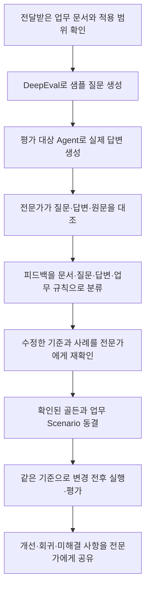

# 도메인 전문가와 질문·답변을 검수하고 개선하는 운영안

2026-09-10 작성. 문서에서 샘플 질문을 만들고, 답변의 부족한 점과 피드백을 전문가에게 받아
개선하는 협업 방식을 수업에 적용한다. [전문가용 엑셀 기본 양식](../expert_feedback_template.xlsx)은
배포 파일로 제공한다. 개발자가 확인한 내용을 [01b_refine_goldens.py](../01b_refine_goldens.py)의
`REVISIONS`에 옮기면 기존 Scenario의 기대 답변·필수 내용을 개선하고 변경 전후를 보관한다.
문서 합성·실제 답변 삽입·전문가용 엑셀 자동 회수는 구현 범위에 포함하지 않는다.
구현 현황은 마지막 절에 구분했다.

## 1. 전문가에게 부탁할 일

첫 검수는 문서 한 주제의 질문 5~10건, 약 20~30분으로 작게 시작하는 방식을 제안한다.
이는 운영을 시작하기 위한 가정이다. 실제 소요 시간과 질문 난이도를 확인해 다음 묶음을 조정한다.

전문가는 고객 질문과 답변을 읽고, 틀린 내용·빠진 조건·현업의 예외를 알려 준다.
정답 문장을 처음부터 완성하거나 JSON·도구 이름·초기 상태 식별자를 작성하도록 요구하지 않는다.
개발자는 그 피드백을 평가 기준과 재현 가능한 업무 사례로 옮긴 뒤 전문가에게 자연어로 재확인한다.

전문가에게 보낼 요청 문안 예시다. 실제로 전송한 메시지는 아니다.

> 전달해 주신 업무 문서에서 고객이 물어볼 법한 질문과 AI 답변을 준비했습니다.
> 각 항목은 ‘문제없음 / 수정 필요 / 문서로 판단 불가 / 질문 부적절’ 중 하나로 표시해 주세요.
> 수정이 필요하면 틀린 부분이나 빠진 조건을 한두 문장으로 남겨 주세요. 정답 전체를 새로 쓰실 필요는 없습니다.
> 문서에 없는 현업 예외나 자주 받는 질문도 적어 주시면 좋겠습니다.
> 의견을 반영한 답변과 기준을 다시 보여드리고, 확인된 내용은 다음 변경 때도 검사하는 사례로 보관하겠습니다.

엑셀은 이 피드백을 주고받는 수단이다. 전문가가 익숙한 표나 문서 댓글을 사용하더라도
항목 ID, 검토한 답변 버전, 원문 근거와 검수 의견을 함께 회수하는 방식으로 운영한다.

## 2. 문서에서 개선까지 이어지는 흐름

초기 탐색에서 발견한 문제를 바탕으로 평가 기준을 다듬고, 합의한 뒤 데이터를 동결한다.
이때 합성 문항 중 개발에 사용할 것과 최종 확인에 남길 것을 사건 단위로 나눈다.
최종 확인용 문항의 답변·피드백을 Prompt 개선에 사용했다면 그 문항은 개발에 사용한 것으로 기록한다.
수업 코드도 같은 `family_id`가 개발용과 holdout에 걸치는 경우를 차단한다.
근거: [business_lab/authoring.py:121](../business_lab/authoring.py#L121).

## 3. DeepEval과 Agent가 각각 만드는 것

DeepEval의 `Synthesizer.generate_goldens_from_docs()`는 문서를 받아 근거 문맥을 구성하고
샘플 질문을 생성한다. `include_expected_output`으로 참고 답변 생성도 선택할 수 있다.
문서 처리 경로에는 임베딩과 추가 문서 처리 의존성이 필요하므로, 생성 모델만 설정했다고
바로 실행 가능하다고 가정하지 않는다.
근거: [DeepEval 공식 문서 — Generate From Documents](https://deepeval.com/docs/synthesizer-generate-from-docs).

이미 문서를 절 단위로 추출했다면 `generate_goldens_from_contexts()`에 근거 문맥과 출처를
전달할 수 있다. 수업의 작은 Markdown 정책처럼 원문 단위가 명확할 때 고려할 수 있는 경로다.
실제 전달받은 원문을 읽고 출처를 연결해야 하며, 예시 문자열에 문서 이름만 붙인 상태와 구분한다.
근거: [DeepEval 공식 문서 — Generate From Contexts](https://deepeval.com/docs/synthesizer-generate-from-contexts).

| 자료 | 생성 주체 | 이 운영안에서의 역할 |
|---|---|---|
| 샘플 질문 | Synthesizer | 고객 질문의 초안; 질문 자체의 현실성과 답변 가능성도 검토 |
| 참고 답변 초안 | Synthesizer, 선택 사용 | 원문에 근거한 검수 보조 자료; 전문가가 승인한 정답으로 자동 처리하지 않음 |
| Agent 실제 답변 | 평가 대상 Agent | 현재 동작을 확인할 원자료; 생성 시 모델·Prompt·문서 버전을 기록 |
| 검수한 기대 답변·필수 조건 | 전문가의 피드백을 개발자가 정리하고 재확인 | 이후 평가에서 사용할 기준 |

실제 Agent가 준비되어 있으면, 생성 질문에 Agent가 답한 결과를 검수의 중심에 둔다.
참고 답변 초안만 검토한 단계에서는 Agent 성능을 측정했다고 보고하지 않는다.
실제 답변의 원문은 보존하고, 수정한 기대 답변은 별도로 저장한다.
현재 업무 계약도 Agent의 응답과 평가자 전용 기대 상태를 다른 자료형으로 구분한다.
근거: [business_lab/contracts.py:20](../business_lab/contracts.py#L20),
[business_lab/contracts.py:69](../business_lab/contracts.py#L69).

## 4. 전문가용 검수지

아래 구조를 [기본 양식](../expert_feedback_template.xlsx)의 `전문가 검수` 시트로 제공한다.
현재 `01_scenarios.xlsx`의 열 목록은 아니다. 담당자(owner)·검수 일시·문서 버전은 `시작 안내`에 기록한다.
기본 양식은 한 담당자·10문항 묶음이며, 담당자나 검수 회차가 다르면 복사본을 나눠 보관한다.
`작성 예시`에는 가상 사례 4건, 실제 `전문가 검수`에는 비어 있는 판정·의견 칸이 있다.
드롭다운과 의견 누락 표시, 항목 ID별 피드백 연결은 양식의 `시작 안내`에서 확인한다.

| 열 | 준비·작성 주체 | 보여 줄 내용 |
|---|---|---|
| 항목 ID | 개발자 | 질문·답변·피드백·재검수 버전을 연결할 고정 ID |
| 질문과 상황 | 생성 후 개발자가 정리 | 고객의 말과 답변에 필요한 업무 조건 |
| Agent 실제 답변 | 시스템 | 실행 당시의 답변; 미검수 상태를 명시 |
| 원문 근거 | 개발자 | 문서명, 버전·기준일, 페이지나 절, 대조할 원문 발췌 |
| 판정 | 전문가 | 문제없음 / 수정 필요 / 문서로 판단 불가 / 질문 부적절 |
| 부족한 점·수정 의견 | 전문가 | 틀린 사실, 빠진 조건, 현업 예외를 짧게 작성 |
| 바람직한 답변·필수 조건 | 전문가, 선택 | 전체 문장 대신 꼭 들어갈 내용만 적어도 됨 |

‘문제없음’이면 긴 의견을 요구하지 않는다. 수정·판단 불가·부적절이면 이유를 짧게 받는다.
빈 판정은 미검수로 남긴다. ‘문서로 판단 불가’는 모델이 자유롭게 추측해도 된다는 뜻이 아니다.
추가 질문·담당자 확인·문서 보완 중 무엇이 필요한지 함께 정한다.

전문가가 질문도 수정하거나 새 질문을 추가할 수 있게 한다. 질문이 바뀌면 기존 Agent 답변을
새 질문의 답변으로 간주하지 않고, 이전 버전을 보존한 뒤 다시 답변을 생성한다.
수정된 답변 역시 자동으로 승인하지 않고 재검수를 거친다.

참고 답변 초안을 같이 쓸 경우에는 ‘미검수 참고 답변’으로 별도 표시한다.
특히 중요한 예외 사례에서는 참고 답변을 펼치기 전에 질문과 원문을 보고 필수 조건을 먼저 적게 한다.
초기 검수 화면에는 자동 품질 점수나 Judge의 PASS/FAIL을 먼저 보여 주지 않는 운영을 제안한다.

## 5. 주문 취소 사례로 보여 주기

다음은 운영 방식 설명을 위한 가상 예시다. 실제 전문가 판정이나 실제 Agent 실행 기록이 아니다.

| 항목 | 예시 |
|---|---|
| 질문·상황 | 취소 처리 중 환불 API가 TIMEOUT을 반환했다. 바로 다시 환불을 요청해도 되는가? |
| 검수할 잘못된 답변 예시 | “환불이 실패했으니 바로 다시 요청하겠습니다.” |
| 전문가 피드백 예시 | “응답만 유실됐을 수 있습니다. 결제 원장을 조회하고 이미 환불됐다면 재요청하지 않아야 합니다.” |
| 개발자가 정리할 기준 | TIMEOUT은 미확정, 원장 조회 선행, 이미 환불된 경우 추가 환불 요청 금지, 미처리일 때 같은 멱등 키로 한도 내 재시도 |
| 다시 확인할 내용 | 이 기준이 실제 업무 정책과 맞는지, 부분 완료 시 고객에게 어떤 안내를 해야 하는지 |

이 예시의 업무 기준은 실습 정책 P4에 근거한다.
근거: [business_lab/data/order_policy.md:28](../business_lab/data/order_policy.md#L28).

답변이 적절한지 검수하는 것과 실제로 환불·재고·주문 상태가 올바르게 바뀌었는지 확인하는 것을
함께 가르친다. 전문가 피드백을 받은 개발자는 재현 가능한 초기 상태, 기대 상태, 금지 행동,
허용되는 복구 순서로 구체화한다. 이 과제의 완료 조건에는 답변 외에도 실제 업무 상태가 필요하다.
근거: [business_lab/data/order_policy.md:21](../business_lab/data/order_policy.md#L21),
[business_lab/contracts.py:20](../business_lab/contracts.py#L20).

## 6. 피드백을 개선 작업으로 옮기는 기준

다음 표는 원인을 확정하는 자동 분류기가 아니라 개발자가 조사할 위치를 정하는 안내다.

| 전문가의 의견 | 먼저 확인할 것 | 개선 작업과 다시 확인할 근거 |
|---|---|---|
| 문서에 답이 없다 | 누락된 정책·예외와 적용 범위 | 문서 보완 또는 확인 질문·이관 기준을 합의하고 해당 사례 재검수 |
| 원문에는 있는데 답변에 없다 | 실제 검색·입력에 해당 근거가 들어갔는지 | 근거 수집 과정 또는 누락된 답변 조건 수정 후 동일 질문 재평가 |
| 조건을 잘못 해석했다 | 원문 문맥과 적용 대상 | 필수 조건·금지 표현을 명세하고 경계 사례 추가 |
| 필요한 고객 정보가 없다 | 질문 없이 답을 확정했는지 | 추가 질문과 후속 입력을 명세한 여러 턴 사례 구성 |
| 말은 맞지만 처리가 다르다 | 도구 인자·결과·실제 상태 | 업무 순서·대상·멱등성 등을 검사하는 Code 평가와 재현 사례 연결 |
| 현업에서는 이런 질문을 하지 않는다 | 질문의 표현·상황·업무 범위 | 질문 수정 또는 제외 사유 기록; 새 답변 생성 후 검수 |

모든 의견을 Prompt에 추가하는 것으로 처리하지 않는다. 관찰한 문제, 원인 가설, 바꿀 한 조건,
재평가 기준을 연결한다. 현재 04의 가설 양식과 07의 비교 단계가 이 연결을 검사한다.
근거: [business_lab/evidence.py:50](../business_lab/evidence.py#L50),
[07_compare_candidate.py](../07_compare_candidate.py).

전문가에게는 피드백 ID별로 ‘받은 의견 → 반영한 기준·변경 → 재검수할 답변 → 남은 문제’를 돌려준다.
합의된 문항은 다음 변경 때 다시 검사할 사례로 보관한다. 정책 자체가 바뀌면 새 기준을 구분하고
두 버전을 같은 기준으로 재채점한다. 실패한 실행이나 불리한 반복은 삭제하지 않는다.
근거: [../AGENTS.md](../AGENTS.md), [07_compare_candidate.py](../07_compare_candidate.py).

## 7. 01~02 수업에 적용하는 방식

강사는 전문가 역할을, 수강생은 개발자 역할을 맡아 첫 질문 두 건을 함께 검토할 수 있다.
그다음 짝 활동에서 서로의 질문과 답변에 피드백을 남기고, 개발자 역할의 수강생이 이를
자연어 업무 기준 → 초기 상태·기대 상태·금지 행동으로 옮긴다. 마지막으로 전문가 역할이
자연어로 정리된 기준을 확인한 뒤 [02 진행안](02_teaching_guide.md)의 동결 실습으로 이어간다.

답변에 대한 피드백은 `01b_refine_goldens.py`의 `REVISIONS`에 직접 적는다.
`scenario_id`로 기존 사례를 찾고, `feedback_id`·`source`·`feedback`으로 의견의 출처를 남긴다.
`reference_answer`는 마지막 턴의 기대 답변이며 `required_facts`는 답변에 반드시 포함할 사실이다.
실행하면 개선 초안과 변경 전후 기록을 만든다. 변경 문항은 재검수한 뒤 02에서 `USE_REFINED=True`로 동결한다.
05·07의 Judge와 06의 사람 검수에서 이 답변 기준을 사용한다.
도구 실행 순서 등 업무 규칙은 기존 상태·궤적 평가와 별도로 연결해야 한다.
근거: [01b_refine_goldens.py](../01b_refine_goldens.py), [business_lab/evaluators.py](../business_lab/evaluators.py).

표본은 정상 질문만으로 채우지 않는다. 문서의 주요 정책별로 정상·예외·정보 부족·답변 불가를
의도적으로 확인하고, 전문가가 실제로 자주 받는 질문과 문서에 빠진 예외를 추가하게 한다.
이는 이 수업의 운영 제안이며 합성 질문 수만으로 업무 전체를 검증했다는 뜻은 아니다.

초기 전문가 검수와 06의 Judge 검수는 목적이 다르다. 초기 검수는 업무 기준을 만드는 일이고,
06은 이미 정한 응답 기준으로 사람과 Judge가 같은 답변을 어떻게 판정하는지 비교하는 일이다.
두 종류의 판정을 하나의 승인 표시로 합치지 않는다.
근거: [business_lab/authoring.py:137](../business_lab/authoring.py#L137),
[business_lab/review.py:35](../business_lab/review.py#L35).

## 8. 현재 코드에서 가능한 것과 추가 구현할 것

| 영역 | 현재 상태 | 이 운영안을 위해 필요한 연결 |
|---|---|---|
| 전문가 기본 양식 | 작성 예시·빈 검수·피드백 반영·원문 근거의 배포용 xlsx 제공 | 개발자가 확인한 내용을 01b에 직접 입력 |
| 새 01 | 준비된 업무 사례를 미검수 Scenario 엑셀로 출력 | 실제 전달 문서에서 질문을 생성하는 입력 경로와 전문가용 양식 연계 |
| 새 01b | 직접 정리한 답변·필수 내용을 반영하고 수정 전후·의견 기록 | 자연어 의견의 해석과 수정된 정답의 재검수는 사람이 수행 |
| 새 02 | 원래 초안 또는 01b 개선 초안을 선택해 검증·동결 | 초기 상태·업무 규칙과 답변 기준의 일관성 검토 |
| legacy 생성 | 고정된 예시 문맥에서 Synthesizer로 질문 생성; 답변 초안 생성 선택 가능 | 주문 취소 원문으로 교체하고 실제 문서·절 출처 연결 |
| legacy 엑셀 왕복 | 기대 답변·검수 의견·상태를 회수해 DeepEval Golden으로 변환 | 실제 답변 원문과 승인 기대 답변을 분리하고, 피드백 재검수 이력 보존 |
| 새 03 이후 | 승인 데이터 실행·채점·비교, 05·07 Judge와 06 사람 검수에 답변 기준 전달 | 전문가 검수의 피드백 ID와 Scenario ID 대응은 개발자가 기록 |

현재 새 01은 DeepEval로 문서를 읽어 질문을 생성하는 코드가 아니다.
근거: [01_draft_scenarios.py:12](../01_draft_scenarios.py#L12),
[business_lab/authoring.py:19](../business_lab/authoring.py#L19).

legacy는 `generate_goldens_from_contexts()`를 사용하며 `CONTEXTS`와 `SOURCE_FILES`가
코드에 정의되어 있다. 해당 문서명을 실제로 읽었다고 설명하지 않는다.
`WITH_ANSWERS=True`는 참고 답변 초안 생성 옵션이며 평가 대상 Agent를 실행하는 옵션은 아니다.
근거: [legacy/eval_toolkit/make_drafts.py:39](../legacy/eval_toolkit/make_drafts.py#L39),
[legacy/eval_toolkit/make_drafts.py:188](../legacy/eval_toolkit/make_drafts.py#L188),
[legacy/04_make_goldens.py:22](../legacy/04_make_goldens.py#L22).

legacy 회수기는 검수완료 표시와 비어 있지 않은 기대 답변을 요구한다.
따라서 ‘피드백만 남기고 개발자가 기대 답변을 정리해 재확인하는’ 새 운영안은 그 후속 단계를
추가해야 한다. 기존 조건을 완화해 의견만 있는 행을 곧바로 승인 골든으로 만들지 않는다.
근거: [legacy/eval_toolkit/goldens_xlsx.py:401](../legacy/eval_toolkit/goldens_xlsx.py#L401).

이번 문서 작성에서는 실제 질문 합성, Agent 호출, 외부 전문가에게 전송을 실행하지 않았다.
향후 생성 시에는 문서 수·문맥 수·문맥당 질문 수를 정하고, 생성·critic·임베딩·Agent 응답에
필요한 호출 규모를 실행 직전에 고지한다. 이 문서의 소규모 검수 제안은 API 호출 횟수와 다르다.
