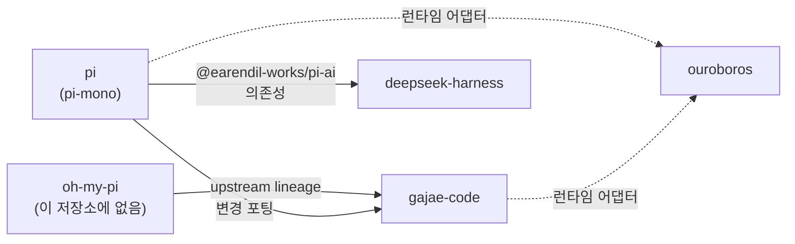

# Day06 — AI Agent Harness 4종 개요

Day06에서 소스를 분석할 대표 하네스 4개의 개요입니다. 세부 분석에 들어가기 전에 **"각 시스템이 무엇이고, 어디서부터 읽어야 하는가"** 를 잡는 지도로 씁니다.

- 모든 경로는 `Day06/` 기준입니다. 근거는 `경로:줄` 형식으로 붙였습니다.
- 각 폴더는 아래 커밋을 `git clone --depth 1`로 받은 뒤 `.git`을 지운 스냅샷입니다. upstream은 추적하지 않습니다.
- 네 저장소 모두 MIT 라이선스입니다.
- 문서(README 등)와 코드가 다른 곳은 코드를 따르고 ⚠로 표시했습니다.

| 폴더 | 원본 | 스냅샷 커밋 | 커밋 일시 |
|---|---|---|---|
| `ouroboros/` | github.com/Q00/ouroboros | `97098488` | 2026-09-13 |
| `gajae-code/` | github.com/Yeachan-Heo/gajae-code | `9da99cdd` | 2026-09-13 |
| `pi/` | github.com/earendil-works/pi | `71dca871` | 2026-09-11 |
| `deepseek-harness/` | github.com/deepseek-ai/deepseek-harness | `c291e796` | 2026-09-10 |

---

## 0. 한눈에 비교

| | **pi** | **gajae-code** (`gjc`) | **deepseek-harness** (`dsh`) | **ouroboros** (`ooo`) |
|---|---|---|---|---|
| 한 줄 정의 | 최소 기능 터미널 코딩 하네스 | 워크플로 내장형 터미널 코딩 하네스 | 모든 것이 플러그인인 제품형 하네스 | 기존 코딩 에이전트 **위에** 얹는 명세 우선 오케스트레이션 계층 |
| 계층 | 에이전트 루프 직접 구현 | 에이전트 루프 직접 구현 | 에이전트 루프 직접 구현 (루프도 플러그인) | 루프를 직접 돌리지 않고 Claude Code·Codex 등을 **런타임**으로 호출 |
| 언어·런타임 | TypeScript / Node ≥22.19 / npm workspaces | TypeScript / Bun + Rust(napi-rs) | TypeScript / Node / pnpm + Cordis, C/C++ 네이티브, Python SDK | Python ≥3.12 (+ Rust TUI) |
| 설계 철학 | 코어는 작게, 나머지는 확장으로 | 계획 → 합의 → 증거로 완료 판정 | 코어를 고치지 않고 설정 패치로 조립 | 모호함을 먼저 없애고, 명세로 실행하고, 평가로 진화 |
| 권한·샌드박스 | **없음**. 확장 훅으로 직접 구현 | bash 제한 프로필, plan-mode 가드, CoW 격리(pi-iso) | 3단계 권한 프리셋 + OS 샌드박스(fail-closed) + 승인 | 역할별 3단계 SandboxClass를 각 런타임 권한으로 번역 |
| 서브에이전트 | **없음**. 예제 확장으로 제공 | `task` 도구, 역할 4종 | 여러 백엔드 공존 (in-process·ACP·Codex·Claude Code) | AC 단위 병렬 실행, 페르소나 21종 |
| MCP | **없음**. 확장으로 | 클라이언트 + Coordinator MCP 서버 | 클라이언트 | 서버(스킬→MCP 도구) + 클라이언트 |
| 세션 저장 | JSONL **트리** (분기) | JSONL 트리 | append-only 이벤트 로그 (JSONL/zstd) | append-only 이벤트 스토어 (SQLite) |
| 규모(대략) | TS 약 32만 줄 | TS 약 163만 줄 + Rust 약 11만 줄 | TS/TSX 약 86만 줄 | Python src 약 32만 줄 + tests 약 45만 줄 |

규모는 `find`/`wc`로 잰 대략치이고 테스트를 포함합니다. 네 시스템의 크기를 비교하는 감각 정도로만 쓰세요.

### 네 시스템의 관계

네 저장소는 서로 독립적이지 않습니다. 비교할 때 이 연결을 알고 있어야 "누가 누구의 설계를 이어받았는가"를 구분할 수 있습니다.



- **gajae-code ← oh-my-pi / pi-mono.**
  - `gajae-code/NOTICE.md:5`는 `oh-my-pi`를 "upstream red-claw lineage and implementation DNA"라고 적습니다.
  - `gajae-code/docs/porting-from-pi-mono.md:1-9`는 pi-mono에서 변경을 옮겨오는 절차 문서이고, 마지막 동기화 지점은 `b21b42d`(2026-03-22)입니다.
  - Rust crate 이름(`pi-natives`, `pi-shell`, `pi-iso`)에도 흔적이 남아 있습니다.
  - oh-my-pi와 pi-mono 사이의 정확한 관계는 이 폴더에 근거가 없어 **확인이 필요합니다**.
- **deepseek-harness → pi.** 에이전트 하네스를 포크한 것은 아니고, 런타임 의존성으로 `@earendil-works/pi-ai`를 씁니다(`deepseek-harness/THIRD_PARTY_NOTICES.md:38`). 뼈대는 Cordis 프레임워크를 벤더링한 것입니다(`deepseek-harness/vendor/README.md:13-23`).
- **ouroboros → 나머지.** 런타임 팩토리가 `pi`, `gjc`, `claude`, `codex` 등 14종 이상의 에이전트 CLI를 실행 백엔드로 만듭니다(`ouroboros/src/ouroboros/orchestrator/runtime_factory.py:73-269`).

그래서 수업에서 읽는 순서는 **pi → gajae-code → deepseek-harness → ouroboros** 를 권합니다. 최소 루프를 먼저 보고, 그 위에 워크플로를 얹은 것, 루프 자체를 플러그인으로 분해한 것, 루프 바깥에서 여러 하네스를 조율하는 것 순서로 나아갑니다.

---

## 1. pi — 최소 기능 터미널 코딩 하네스

### 무엇인가

> "Pi is a minimal terminal coding harness" — `pi/packages/coding-agent/README.md:15`

pi 내부를 포크하지 않고도 사용자가 자기 작업 방식에 맞게 에이전트를 바꿀 수 있게 하는 것이 목표입니다. 확장 수단은 Extensions, Skills, Prompt Templates, Themes, Pi Packages입니다.

철학 절(`pi/packages/coding-agent/README.md:495-511`)은 **넣지 않은 기능**을 먼저 명시합니다.

| 넣지 않은 것 | 대안으로 제시하는 것 |
|---|---|
| MCP | README가 딸린 CLI 도구(Skills) 또는 확장 |
| 서브에이전트 | tmux로 pi 인스턴스 여러 개 실행, 또는 확장 |
| 권한 팝업 | 컨테이너에서 실행, 또는 확장으로 확인 흐름 구현 |
| plan mode | 계획을 파일로 작성, 또는 확장 |
| 내장 to-do | TODO.md 파일 ("모델을 헷갈리게 한다") |
| 백그라운드 bash | tmux |

### 구조

npm workspaces 모노레포이고 빌드(의존) 순서는 chord → tui → telemetry → ai → agent → sqlite-node → protocol → client → server → coding-agent입니다(`pi/package.json:16`).

| 패키지 | 역할 |
|---|---|
| `packages/ai` (pi-ai) | 30개가 넘는 LLM 제공자를 하나의 API로 묶음 |
| `packages/agent` (pi-agent-core) | 에이전트 루프, 상태, 차세대 내구성 런타임 `harness/` |
| `packages/coding-agent` | `pi` CLI 본체 (`src/cli.ts` → `src/main.ts`) |
| `packages/tui` | 차등 렌더링 터미널 UI |
| `packages/protocol` / `client` / `server` | CBOR 기반 원격 세션 (server는 실험적) |
| `packages/evals` | 실제 `AgentSession`으로 도는 행동 평가 |

실행 모드는 interactive, print/JSON, RPC(stdin/stdout JSONL), SDK 네 가지입니다. `pi/packages/coding-agent/src/main.ts:930-968`에서 분기합니다.

### 실행 흐름

1. `createAgentSession`(`pi/packages/coding-agent/src/core/sdk.ts:173`)이 `Agent`를 조립합니다. 기본으로 켜지는 도구는 `read`, `bash`, `edit`, `write`입니다(`sdk.ts:256`).
2. `AgentSession.prompt()`(`core/agent-session.ts:1175`)는 슬래시 명령 → `input` 이벤트 → 스킬·템플릿 확장을 거친 뒤 `Agent.prompt`를 호출합니다.
3. `runLoop`(`pi/packages/agent/src/agent-loop.ts:156-273`)
   - 바깥 루프는 follow-up 메시지를, 안쪽 루프는 도구 호출과 steering 메시지를 처리합니다.
   - 도구는 기본적으로 병렬 실행합니다(`:409-424`).
   - `stopReason === "length"`이면 도구 인자가 잘렸을 수 있으므로 해당 도구 호출을 모두 실패 처리합니다(`:227-233`).
4. `message_end`마다 세션 JSONL에 한 줄씩 추가합니다(`core/session-manager.ts:1035`).

### 볼 만한 설계

- **권한은 코어가 아니라 훅으로 처리합니다.** `beforeToolCall`(`agent-loop.ts:626-644`)이 확장의 `tool_call` 이벤트로 이어지고, 확장이 `{block:true}`를 반환하면 실행이 막힙니다. 예제는 `pi/packages/coding-agent/examples/extensions/permission-gate.ts`입니다.
- **서브에이전트도 확장으로 만듭니다.** `examples/extensions/subagent/index.ts:300,346`은 `pi --mode json -p --no-session`을 자식 프로세스로 띄웁니다.
- **세션 트리.** 엔트리마다 `id`/`parentId`가 있고(`session-manager.ts:46-51`), `branch()`는 leaf 포인터만 옮깁니다(`:1374`). 그래서 파일 하나 안에서 분기가 생기고, `/tree`로 이동할 때 떠나는 분기를 요약해 둡니다.
- **컴팩션.** `contextTokens > contextWindow - reserveTokens` 조건에서 발동합니다(`core/compaction/compaction.ts:235-238`). 기본값은 reserve 16384, keepRecent 20000입니다.
- ⚠ **README와 코드의 차이.** README 프롬프트 템플릿 예시의 `{{focus}}` 문법(`pi/packages/coding-agent/README.md:350`)은 실제로 지원되지 않습니다. 코드는 `$1`, `$@`, `$ARGUMENTS`, `${N:-default}`만 처리합니다(`core/prompt-templates.ts:60-70`).
- 내구성 런타임 `AgentHarness`(`pi/packages/agent/src/harness/`)는 아직 `experimental/`에서만 쓰이고, 기본 `pi` 경로에는 연결되어 있지 않습니다.

### 읽기 순서

1. `pi/packages/coding-agent/README.md` — 기능과 철학
2. `pi/packages/agent/src/agent-loop.ts` — 루프 핵심(156-424행)
3. `pi/packages/agent/src/agent.ts` — 상태, 큐, 훅
4. `pi/packages/ai/src/compat.ts`, `pi/packages/ai/src/types.ts` — 통합 LLM API
5. `pi/packages/coding-agent/src/core/sdk.ts` — 조립 과정
6. `pi/packages/coding-agent/src/core/session-manager.ts` — JSONL 트리
7. `pi/packages/coding-agent/examples/extensions/permission-gate.ts`, `subagent/` — 코어에 없는 기능을 확장으로 만든 예

---

## 2. gajae-code (`gjc`) — 워크플로 내장형 터미널 코딩 하네스

### 무엇인가

어떤 저장소나 worktree에도 넣어 쓸 수 있는 터미널 코딩 에이전트입니다. **이미 결제 중인 구독**(Claude, Codex, Cursor, Copilot 등)에 OAuth로 로그인해 돌아갑니다(`gajae-code/README.md:42-44`, `:116-127`).

README가 꼽는 문제는 네 가지입니다(`gajae-code/README.md:54-59`).
- 구독료와 API 요금을 이중으로 내는 문제
- 이해하기 전에 코드부터 고치는 문제
- 사람이 터미널을 떠나면 작업이 멈추는 문제
- 컨텍스트가 불어나는 문제

pi 계열에서 파생했으므로(§0 관계도), **pi와 같은 뼈대 위에 무엇을 더 얹었는지** 보는 것이 비교의 핵심입니다.

### 구조

Bun 워크스페이스 기반 TypeScript 모노레포에 Rust natives를 붙인 구조입니다. 의존 방향은 `utils → ai → agent → coding-agent`이고 `tui`, `natives`가 옆에서 붙습니다(`gajae-code/AGENTS.md:11-16`).

| 위치 | 역할 |
|---|---|
| `packages/coding-agent` | `gjc` CLI 본체. bin 이름은 `gjc`와 `가재씨` |
| `packages/agent` | 에이전트 루프 |
| `packages/ai` | 멀티 프로바이더 스트리밍, 인증, 모델 레지스트리 |
| `packages/tui` | 차분 렌더링 TUI |
| `crates/pi-natives`, `pi-shell`, `brush-*` | 네이티브 grep/AST/PTY, 벤더링한 Rust bash |
| `crates/pi-iso` | copy-on-write 파일시스템 격리 |
| `crates/gjc-sdk` | SDK 프로토콜 |

CLI 명령은 `gajae-code/packages/coding-agent/src/cli.ts:43-82`에 테이블로 있습니다. `setup`, `acp`, `session`, `coordinator`, `ultragoal`, `ralplan`, `deep-interview`, `autoresearch`, `mcp`, `mcp-serve`, `daemon`, `sdk`, `plugin` 등이고, 알려진 하위 명령이 아니면 `launch`로 처리합니다.

### 실행 흐름

1. `runCli`(`src/cli.ts:404`) → `runRootCommand`(`src/main.ts:1384`)
2. `createAgentSession()`(`src/sdk/session.ts:1455`)이 설정, 인증, 모델, hook, 스킬, MCP, 시스템 프롬프트를 조립한 뒤 `new Agent(...)`를 만듭니다(`:4413`).
3. 모드를 ACP, 인터랙티브 TUI, print 중 하나로 분기합니다(`main.ts:1968`, `:2092`, `:2128`).
4. 턴 루프는 `runLoopBody`(`gajae-code/packages/agent/src/agent-loop.ts:3612`)입니다. `streamAssistantResponse` → `executeToolCalls` → `turn_end` 순서로 돌고, 사이사이 steering과 follow-up 메시지를 반영합니다.

루프 모양은 pi와 같습니다. 대신 `agent-loop.ts` 한 파일이 5,648줄로, pi의 같은 파일보다 훨씬 큽니다.

### 볼 만한 설계

- **작게 고정된 계획 중심 워크플로.** 번들 스킬 네 개가 순서대로 이어집니다: `deep-interview → ralplan → ultragoal`, 필요하면 `autoresearch`(`gajae-code/README.md:179-189`).
  - `ralplan`은 Planner, Architect, Critic이 합의할 때까지 계획을 반복합니다(`packages/coding-agent/src/defaults/gjc/skills/ralplan/SKILL.md:12`).
  - `ultragoal` 스킬 지침은 대화 속 goal 상태가 아니라 `goals.json`과 `ledger.jsonl`에 남은 **파일 증거로만 완료를 확인**하도록 규정합니다(`.../skills/ultragoal/SKILL.md:14`). 이 규칙이 코드로 강제되는지는 확인이 필요합니다.
- **서브에이전트는 같은 프로세스 안에서 돕니다.** `task` 도구(`src/task/index.ts:594`)가 `createAgentSession`을 다시 호출합니다(`src/task/executor.ts:1956`). 공개 역할은 executor, architect, planner, critic 네 가지입니다.
- **권한은 사용자 승인이 아니라 프로필로 제한합니다.**
  - bash 제한 프로필 `workflow` / `read-only`(`src/tools/bash-allowed-prefixes.ts:13`)
  - plan-mode에서는 쓰기를 plan 파일로 제한(`src/tools/plan-mode-guard.ts`)
  - ACP 모드에만 `auto | prompt | always-allow` 권한 모드가 있습니다(`src/modes/acp/permission-mode.ts:3`).
  - 일반 TUI에 도구 호출마다 승인을 받는 체계가 있는지는 **확인이 필요합니다**.
- **OS 수준 격리.** `crates/pi-iso/src/lib.rs:1-19`는 macOS에서 APFS clonefile, Linux에서 overlayfs, Windows에서 ProjFS를 쓰고, 안 되면 git worktree나 복사로 대체합니다.
- **외부에서 조종할 수 있습니다.** Coordinator MCP 서버(`src/coordinator/contract.ts`), ACP, Telegram·Discord·Slack 알림(`README.md:158-172`)이 있습니다.
- ⚠ **문서와 코드의 차이.**
  - `AGENTS.md:26`의 `@gajae-code/pi-utils`는 실제 패키지 이름이 `@gajae-code/utils`입니다(`packages/utils/package.json:3`).
  - `src/sdk/session.ts:529`의 `enableMCP`는 deprecated이지만, `enableMcpAutoload`는 기본값이 true입니다(`:538-543`). MCP 지원이 빠진 것이 아니라 예전 플래그만 폐기된 것입니다.

### 읽기 순서

1. `gajae-code/AGENTS.md`, `gajae-code/docs/codebase-overview.md` — 전체 지도
2. `gajae-code/packages/coding-agent/src/cli.ts` → `src/main.ts` — 명령과 모드 분기
3. `gajae-code/packages/coding-agent/src/sdk/session.ts` (`createAgentSession`) — 조립 과정
4. `gajae-code/packages/agent/src/agent-loop.ts` (`runLoopBody`) — 턴 루프 (pi와 대조하며 읽기)
5. `gajae-code/packages/ai/src/stream.ts`, `types.ts` — 프로바이더 추상화
6. `gajae-code/packages/coding-agent/src/task/index.ts`, `executor.ts` — 서브에이전트
7. `gajae-code/packages/coding-agent/src/defaults/gjc/skills/*/SKILL.md` — 워크플로 설계 의도

---

## 3. deepseek-harness (`dsh`) — 모든 것이 플러그인인 하네스

### 무엇인가

> "It is built on an **everything-is-a-plugin** architecture and powered by Cordis" — `deepseek-harness/README.md:7`

모델 어댑터, 도구 레지스트리, 세션 로그, **에이전트 루프까지** 전부 플러그인입니다. 코어를 고치지 않고 설정 패치(`cordis.patch.yml`)만으로 부분을 교체하거나 확장합니다(`deepseek-harness/docs/architecture.md:11-13`). Web UI, headless, SDK, ACP, Electron 데스크톱으로 배포하는 제품형 하네스입니다.

README는 개발자 프리뷰 단계이며 호환성이 깨지는 변경이 있을 것이라고 예고합니다(`deepseek-harness/README.md:11-13`).

### 구조

TypeScript/ESM과 pnpm workspaces를 씁니다. `packages/`에는 약 50개 그룹의 `@deepseek-ai/dsh-<name>` 패키지가 있습니다(`deepseek-harness/AGENTS.md:15-50`).

| 위치 | 역할 |
|---|---|
| `apps/cli` | `dsh` 실행 파일 (`src/bin.ts:28-61`에서 profile / plugin / dump-config로 분기) |
| `apps/web`, `apps/desktop` | React Web UI(기본 `127.0.0.1:3080`), Electron |
| `packages/core/*` | session, system-prompt, tools, agent, agent-loop |
| `packages/llm`, `fs`, `shell`, `sandbox`, `subagent`, `compaction`, … | 기능별 플러그인 |
| `packages/bundle/*` | 프로필을 구성하는 패치 계층 |
| `native/system` | Linux Landlock 런처, flock 네이티브 애드온 (C/C++) |
| `python/sdk` | 줄 단위 JSON-RPC(stdio) 클라이언트 `HarnessClient` |
| `vendor/` | Cordis와 기반 라이브러리 소스 (로컬 수정 19건 기록) |

### 실행 흐름

**부팅.** 설정은 번들 → 프로필 `cordis.patch.yml` → 홈 패치 → `--patch` 순서로 쌓입니다(`docs/architecture.md:17-27`). 공통 계층은 `packages/bundle/base/cordis.patch.yml`이고 기본 모델은 `deepseek-official`/`deepseek-flash`입니다. `dsh --dump-config`를 실행하면 실제로 부팅될 트리를 볼 수 있습니다.

**턴과 스텝.** 스텝 = 모델 요청 1회 + 그 요청이 부른 도구 호출. 턴 = 스텝 0개 이상.

`ReactLoopAgent`(`deepseek-harness/packages/core/agent-loop/src/agent.ts:72`)의 동작:
1. `kick()`이 `while (await this.turn())`을 돌립니다(`:225-238`).
2. `preStep()`은 인박스에서 입력을 가져오고, 시스템 프롬프트를 조립하고, `agent/pre-step` 워터폴을 거칩니다(`:240-259`).
3. `step()`은 `llm.stream`으로 스트리밍한 뒤 결과를 `assistant/message` 또는 `assistant/attempt`로 확정합니다. 실패하면 `agent/request-error` 워터폴에서 재시도 여부를 정합니다(`:352-498`).
4. 도구는 `ToolRuntime`(`packages/core/tools/src/index.ts:780`)이 `tools/pre-execute` → `tools/execute` → `tools/post-execute` 워터폴로 실행합니다.

**워터폴(waterfall)** 은 여러 플러그인이 차례로 값을 넘겨받아 가공하는 이벤트입니다. 컴팩션, 계획 모드, 훅 등이 모두 이 지점에 끼어듭니다.

### 볼 만한 설계

- **"모델에 보이는 것은 로그에 기록된 것."**
  > "Anything that reaches a model request must be reconstructable from the log, and a runtime invariant asserts it." — `deepseek-harness/docs/architecture.md:121`

  모델 입력에 새 정보를 넣으려면 새 세션 이벤트부터 정의해야 합니다. fork, resume, 텔레메트리도 모두 이 로그에서 파생됩니다.
- **권한과 샌드박스.**
  - 권한 프리셋은 `read-only` / `workspace-write` / `danger-full-access`이고, 기본값은 `workspace-write` + `ask`입니다(`packages/bundle/base/cordis.patch.yml:205-241`).
  - 로컬 샌드박스는 Linux bwrap→Landlock, macOS Seatbelt, Windows ACL 제한 토큰을 씁니다. 격리를 할 수 없으면 원래 명령을 그대로 실행하지 않고 **거부합니다(fail-closed)** (`packages/sandbox/sandbox-local/src/index.ts:1-6`).
  - 다만 `deepseek-harness/SAFETY.md:7-15`는 샌드박스가 격리를 보장하지 않으며 보안 감사를 받지 않았다고 명시합니다.
- **다른 제품을 흡수합니다.**
  - 서브에이전트 백엔드로 in-process spawn/fork, ACP, Codex, Claude Code, dsh-sdk가 이름으로 공존합니다(`docs/subsystems/subagent.md:5-7`).
  - `hooks-claude-code`는 Claude Code 훅 형식을 dsh 이벤트에 연결합니다(`packages/hooks/hooks-claude-code/src/index.ts:218-270`). UserPromptSubmit → `agent/pre-step`, PreToolUse → `tools/pre-execute`, PostToolUse → `tools/post-execute`, Stop → `agent/turn-stopping`입니다.
- **Programmatic Tool Calling.** `run_code` 모드에서는 모델이 코드 안에서 도구를 호출합니다(`packages/core/tools/src/ptc.ts:1-7`).
- ⚠ **문서와 코드의 차이.**
  - `BENCHMARK.md`는 Python SDK 예제로 돌리라는 3줄 안내뿐입니다. 실제 `benchmarks/`는 모델 평가가 아니라 **성능 게이트**(세션 열기 속도 등)입니다(`benchmarks/AGENTS.md:3`). 동작 회귀는 녹화된 세션을 재생하는 `snapshots/`로 검증합니다.
  - `apps/cli/README.md:28`은 tui 프로필 예시를 들지만, 기본 제공 프로필 목록(`docs/architecture.md:19`)에는 TUI가 없습니다.

### 읽기 순서

1. `deepseek-harness/docs/architecture.md` — 프로필, 턴 흐름, 확장 지점
2. `deepseek-harness/docs/cordis-primer.md` — ctx, 서비스, 워터폴 개념 (이것 없이는 코드가 읽히지 않습니다)
3. `deepseek-harness/packages/bundle/base/cordis.patch.yml` — 실제로 조립되는 것
4. `deepseek-harness/apps/cli/src/bin.ts` → `profile-boot.ts` — 부팅 경로
5. `deepseek-harness/packages/core/agent-loop/src/agent.ts` — 루프 본체
6. `deepseek-harness/packages/core/tools/src/index.ts` — 도구 파이프라인
7. `deepseek-harness/packages/sandbox/sandbox-local/src/index.ts`, `packages/hooks/hooks-claude-code/src/index.ts` — 보안 경계와 확장 예

---

## 4. ouroboros (`ooo`) — 명세 우선 오케스트레이션 계층

### 무엇인가

앞의 세 개와 **층위가 다릅니다**. 스스로 모델을 불러 코딩 루프를 돌리는 대신, Claude Code·Codex·pi·gjc 같은 기존 에이전트를 **실행 런타임**으로 쓰는 위쪽 계층입니다. 스스로를 "Agent OS"라고 부릅니다(`ouroboros/README.md:78`).

AI 코딩이 실패하는 원인을 **모호한 입력**으로 보고, 다음 순환 구조로 해결합니다(`ouroboros/docs/architecture.md:175-196`).

```
인터뷰 → Seed(명세) → 실행 → 평가 → 진화 → (다시 실행)
```

배포 형태는 Python CLI(`ooo`/`ouroboros`), MCP 서버, Claude Code 플러그인(skills + hooks + `.mcp.json`)입니다.

### 구조

Python 3.12 이상이고 Typer, Pydantic, SQLAlchemy+aiosqlite를 씁니다. `ouroboros/src/ouroboros/` 아래 주요 디렉터리:

| 디렉터리 | 역할 |
|---|---|
| `bigbang/` | 인터뷰, 모호성 점수, Seed 생성 |
| `core/` | Seed·AC 모델, worktree |
| `orchestrator/` | 실행 엔진, 런타임 어댑터 14종 이상 (가장 큼) |
| `evaluation/` | 3단계 평가 |
| `evolution/` | Wonder/Reflect 진화 루프 |
| `providers/` | LLM 호출만 필요한 곳의 어댑터 |
| `mcp/` | MCP 서버·클라이언트·도구 |
| `persistence/` | 이벤트 스토어 |
| `agents/*.md` | 페르소나 프롬프트 21개 |

저장소 루트에는 `skills/`(SKILL.md 22개), `hooks/hooks.json`, `crates/ouroboros-tui`(Rust)가 있습니다.

### 실행 흐름

1. **인터뷰.** `InterviewEngine`(`bigbang/interview.py:764`)이 질문과 응답을 반복하며 매 턴 모호성 점수를 계산합니다(`bigbang/ambiguity.py:342`). **점수가 `AMBIGUITY_THRESHOLD = 0.2`(`bigbang/ambiguity.py:37`) 이하여야 Seed를 만들 수 있습니다.**
2. **Seed.** `force=True`일 때만 게이트를 우회하고, 우회 사실을 provenance에 남깁니다(`bigbang/seed_generator.py:1634-1655`). Seed는 불변(`frozen=True`) Pydantic 모델입니다(`core/seed.py:768`).
3. **실행.** `OrchestratorRunner.execute_seed`(`orchestrator/runner.py:8454`) → `ParallelACExecutor`(`orchestrator/parallel_executor.py:2625`). `DependencyAnalyzer`가 세운 단계별 계획대로 AC(수용 기준)를 병렬로 실행합니다. AC가 너무 크다고(`TOO_BIG`) 판정되면 2~5개로 쪼갭니다.
4. **런타임 호출.** 모든 백엔드는 `AgentRuntime` 프로토콜(`orchestrator/adapter.py:954`)로 호출하고, 결과를 `AgentMessage`와 `RuntimeHandle`로 정규화합니다.
5. **평가.** `EvaluationPipeline`(`evaluation/pipeline.py:63`)은 Mechanical(lint/build/test) → Semantic(LLM) → 조건부 Consensus(여러 모델) 순서입니다.
6. **진화.** `EvolutionaryLoop`(`evolution/loop.py:174`)가 wonder → reflect → 실행 → 평가를 돕니다. 온톨로지 유사도 0.95 이상이거나 최대 30세대면 멈춥니다(`evolution/convergence.py:41-56`).

### 볼 만한 설계

- **권한 결정은 엔진이 한 곳에서만 합니다.** 역할마다 SandboxClass를 정확히 하나씩 매핑하고(`orchestrator/policy.py:255-264`), 각 런타임 어댑터는 이 결정을 다시 내리지 않고 번역만 합니다.

  | 역할 | SandboxClass |
  |---|---|
  | INTERVIEW, EVALUATION | READ_ONLY |
  | COORDINATOR | WORKSPACE_WRITE |
  | IMPLEMENTATION | UNRESTRICTED (Claude 런타임에서는 권한 확인 우회로 번역되고 경고 로그를 남김) |

- **채점 기준을 워커에게 숨깁니다.** AC의 `verify_command`와 `output_assertion`은 워커 프롬프트에서 제거합니다(`orchestrator/atomic_prompt_builder.py:34-40`). 다른 경로로 새는 값도 여러 인코딩 변형까지 가립니다(`orchestrator/contract_redaction.py:13-32`). 다만 리터럴 매칭이라 변형된 복사본은 통과할 수 있다는 한계가 명시되어 있습니다.
- **런타임 중립.** 같은 Seed, 이벤트 원장, 평가를 14종 이상의 에이전트 CLI에서 재사용합니다.
- **이벤트 소싱.** append-only `events` 테이블(`persistence/schema.py:42-73`)이 있어, `ooo ralph` 루프는 매 스텝을 stateless로 돌리고 lineage를 이벤트 스토어에서 복원합니다.
- **드리프트 측정.** goal 0.5 / constraint 0.3 / ontology 0.2 가중치로 계산하고 임계값은 0.3입니다(`observability/drift.py:51-56`). PostToolUse 훅이 파일 수정마다 이를 확인합니다(`hooks/hooks.json`).
- ⚠ **문서와 코드의 차이.**
  - 문서의 "All LLM calls go through LiteLLM"(`docs/architecture.md:583`)과 달리, LiteLLM은 여러 백엔드 중 하나인 optional extra입니다(`providers/factory.py:342`). 기본 백엔드는 `claude_code`입니다(`config/models.py:148`).
  - 문서에 나오는 `routing/` PAL Router 디렉터리(`docs/architecture.md:220-225`)는 실제로 없습니다. 모델 티어 라우팅은 `orchestrator/model_routing.py`에 있습니다.
  - Consensus 기본 모델은 문서의 "Claude Sonnet 4"(`docs/architecture.md:361`)가 아니라 `config/loader.py:131-135`에 정의된 목록입니다.
  - 컨텍스트 예산 `context_governor.py`는 docstring에 "wiring-only"라고 되어 있어(`:18-19`), 실제로 연결됐는지 **확인이 필요합니다**.

### 읽기 순서

1. `ouroboros/docs/architecture.md` — 전체 지도 (⚠ 표시한 부분 주의)
2. `ouroboros/src/ouroboros/core/seed.py` — 모든 흐름의 계약 객체
3. `ouroboros/src/ouroboros/bigbang/ambiguity.py` → `bigbang/interview.py` — 모호성 게이트
4. `ouroboros/src/ouroboros/orchestrator/adapter.py` — `AgentRuntime` 프로토콜
5. `ouroboros/src/ouroboros/orchestrator/runner.py` — `execute_seed`(8454행)부터 발췌해서 (파일 전체는 12,000줄 이상)
6. `ouroboros/src/ouroboros/orchestrator/policy.py`, `sandbox.py` — 권한 모델
7. `ouroboros/src/ouroboros/evaluation/pipeline.py` → `evolution/loop.py` — 검증과 진화
8. `ouroboros/src/ouroboros/mcp/tools/definitions.py`, `ouroboros/hooks/hooks.json` — 호스트 에이전트와 연결되는 지점

---

## 5. 비교 분석을 위한 질문

소스를 읽으며 네 시스템에 같은 질문을 던지면 차이가 드러납니다.

1. **루프는 어디에 있고, 누가 멈춤을 결정하는가?** pi/gjc는 `agent-loop.ts` 하나, dsh는 플러그인과 워터폴, ouroboros는 루프 바깥의 평가·수렴 조건입니다.
2. **도구 실행 전에 무엇이 끼어들 수 있는가?** pi `beforeToolCall`, gjc bash 프로필, dsh `tools/pre-execute`, ouroboros SandboxClass 번역.
3. **모델이 본 입력을 나중에 재현할 수 있는가?** dsh는 런타임 불변식으로 강제하고, pi/gjc는 JSONL 트리에 남기고, ouroboros는 이벤트 스토어에 요약만 둡니다.
4. **"완료"의 판정 근거는 무엇인가?** 모델의 종료 선언, 파일 ledger(gjc `ultragoal`), 기계 검증 + LLM 평가(ouroboros).
5. **코어에 넣지 않은 기능은 무엇이고, 그 대가는 무엇인가?** pi의 "No MCP / No sub-agents / No permission popups"를 기준선으로 삼아, 나머지 세 시스템이 무엇을 코어로 끌어올렸는지 비교합니다.

---

## 부록. 저장소별 에이전트 지침 파일

클론한 저장소는 각자 `AGENTS.md`·`CLAUDE.md`·`.claude/skills/` 같은 **자기 개발팀용 에이전트 지침**을 갖고 있습니다(예: `deepseek-harness/.claude/skills/`). AI 에이전트로 해당 폴더를 분석하면 이 지침이 함께 로드될 수 있습니다. 이 지침은 **그 프로젝트에 기여하는 사람**을 위한 것이지, 이 수업 실습 규칙이 아닙니다.
